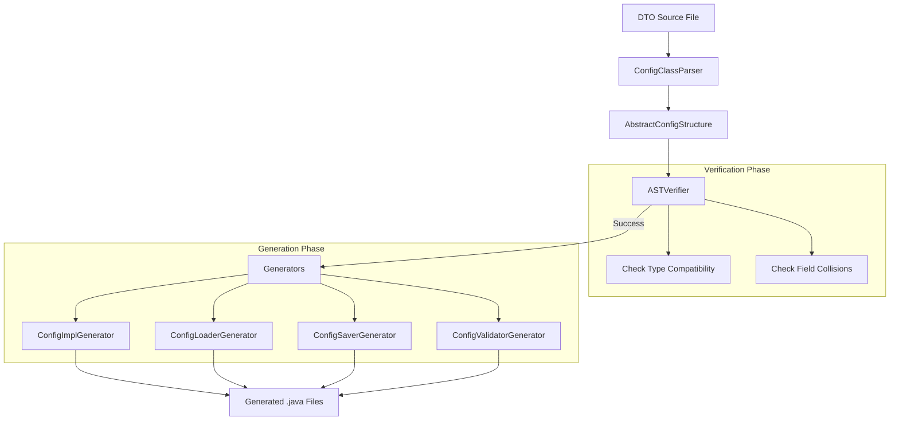

# Pipeline Deep Dive

This page covers the internal mechanics of MittenLib's annotation processor for those interested in how DTOs are transformed into generated code.

:::note
This is an advanced topic. For usage documentation, see the [Config Processor guides](./getting-started).
:::

## The Generation Pipeline

## Key Components

### ConfigClassParser
The entry point of the processor. It uses the `aptk` (Annotation Processor Toolkit) to inspect your DTOs and build a language-agnostic **AST (Abstract Syntax Tree)** representing your config.

### ASTVerifier
Ensures that the requested configuration is valid for generation. It checks for:
*   Circular dependencies (Configs referencing themselves).
*   Unsupported types (e.g., trying to use a type without a known Serializer).
*   Field name collisions between inherited DTOs.

### Serialization Strategy
MittenLib uses a **DataTree** intermediate representation. This allows the same configuration to be loaded from YAML, JSON, or any other format without changing the generated code.
